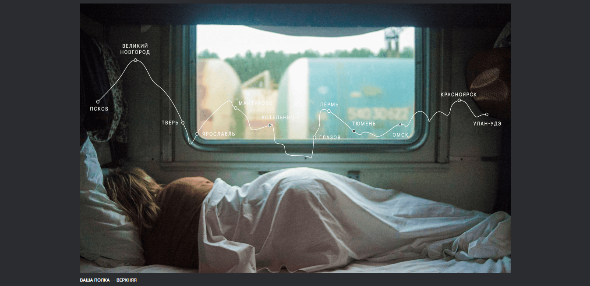

# Проект: Путешествие по России

### Обзор
* Описание
* Применяемые технологии
* GitHub Pages

**Описание**

Данный проект представляет собой одностраничный сайт, состоящий из 7 блоков. В проекте содержится информация о некоторых интересных местах России как альтернативы заграничному отдыху, а также сразу даны ссылки на популярные ресурсы Яндекса (карты, расписание, путешествия) на случай, если вдохновившись, вам захочется посетить что-нибудь из предложенного:) 

**Применяемые технологии**

1. Работа выполнена в соответствии с методологией БЭМ.
2. Для создания сеток применяются flexbox и grid.
3. В проекте реализована адаптивная верстка.

**GitHub Pages**

Мой проект на [GitHub Pages](https://tatyanakarpova.github.io/russian-travel/index.html).
